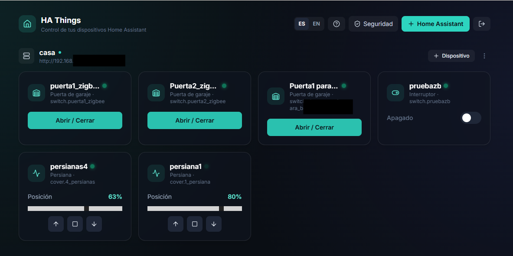
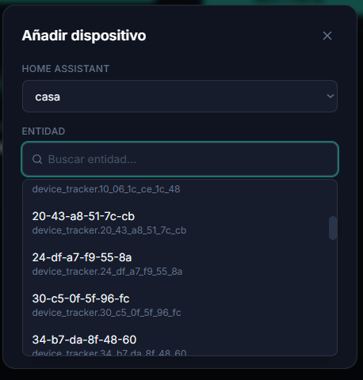
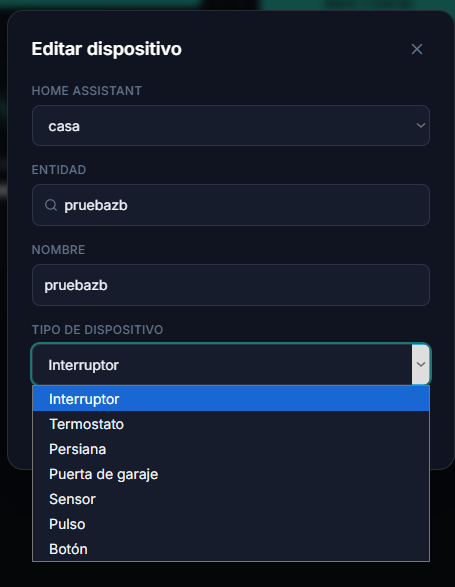
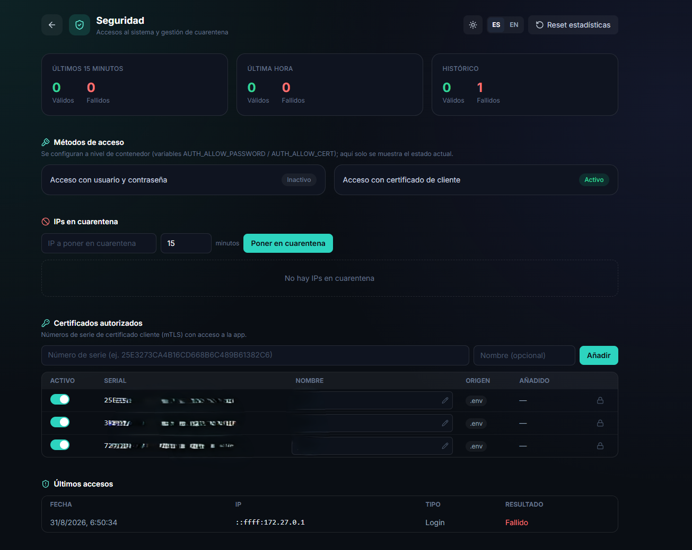
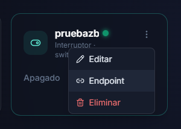
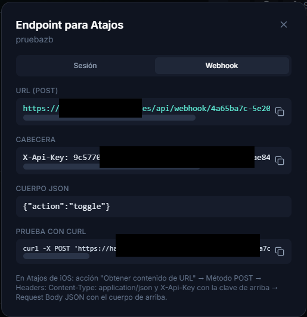
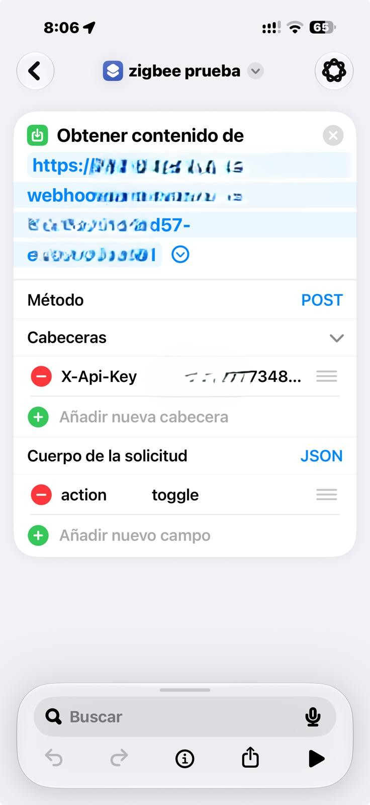

# HA Things

*[Read this in English](#english) ↓*

**HA Things** es un panel web ligero, propio y auto-alojado para controlar y automatizar tu casa a través de Home Assistant — sin depender de la app oficial ni de acceso remoto complicado. Conecta una o varias instancias de Home Assistant, elige qué dispositivos y automatizaciones quieres exponer, y ya tienes un panel de control accesible desde cualquier navegador, con integración nativa para **Atajos de iOS** (control por voz con Siri, widgets, automatizaciones del propio iPhone) mediante un endpoint webhook seguro. Pensado para ejecutarse en Docker en tu propia red o detrás de tu proxy, con foco en seguridad (mTLS, API keys, cuarentena por fuerza bruta) y en no depender de terceros para controlar tu hogar.

El modelo de "cosas" (things) sigue la misma idea que [homebridge-homeassistant-things](https://github.com/torresyago/homebridge-homeassistant-things): defines dispositivos apuntando a una entidad de Home Assistant y un tipo de control — pero además de operar dispositivos, HA Things también permite **ejecutar automatizaciones de Home Assistant** directamente desde el panel o desde un atajo de iOS, con un solo toque.



## Características

- Añade una o varias instancias de Home Assistant (nombre, URL y token de acceso de larga duración).
- Explora y busca las entidades de cada instancia al añadir un dispositivo, sin escribir el `entity_id` a mano.

  

- Tipos de dispositivo soportados, cada uno con su propio control:
  - **Interruptor** (switch/light/input_boolean): toggle on/off.
  - **Termostato** (climate): temperatura actual y objetivo con +/-.
  - **Persiana** (cover): posición 0-100% y botones abrir/parar/cerrar.
  - **Puerta de garaje**: si es `cover`, abrir/cerrar; si es un `switch` de relé, pulso automático.
  - **Sensor**: lectura de solo lectura con su unidad.
  - **Pulso**: interruptor momentáneo que se apaga solo tras `pulseDuration` ms.
  - **Botón**: dispara `button.press` o `script.turn_on`.
  - **Automatización**: ejecuta una `automation.*` de Home Assistant (`automation.trigger`, saltándose sus condiciones) o un `script.*`, con un solo toque — igual que el botón "Ejecutar" de Home Assistant.

  

- Estado en vivo por sondeo cada 5 segundos, con indicador visual (bola verde parpadeante = en línea, bola roja parpadeante = sin respuesta o entidad `unavailable` en Home Assistant) en cada tarjeta. Cuando está en rojo, muestra además cuándo se vio con estado válido por última vez (dato en memoria del servidor, se reinicia con el contenedor).
- Login opcional de un único usuario/contraseña para proteger el panel.
- Endpoint webhook (`/api/webhook/:deviceId`) protegido con API key, pensado para integraciones externas (p. ej. Atajos de iOS) que no pueden presentar certificado de cliente.
- Panel de seguridad: accesos válidos/fallidos (últimos 15 min, última hora, histórico), reset de estadísticas y gestión manual de IPs en cuarentena.
- Interfaz en español o inglés (botón ES/EN en la cabecera, se recuerda entre sesiones) y botón de ayuda con una guía rápida de uso.
- Modo claro / oscuro (icono de sol/luna en la cabecera, se recuerda entre sesiones).

## Puesta en marcha con Docker (recomendado)

Dos formas de desplegarlo, según prefieras compilar tú mismo o usar la imagen ya publicada. En ambas, deja `ADMIN_USER`/`ADMIN_PASSWORD` vacíos en el `.env` si no quieres pedir login (pensado para uso en red local de confianza).

### Opción A: build local (clonando el repo)

Ejemplo de `docker-compose.yml` (construye la imagen desde el código, tal cual está en el repo):

```yaml
services:
  ha-things:
    build: .
    container_name: ha-things
    ports:
      - "3000:3000"
    environment:
      - PORT=3000
      - SESSION_SECRET=${SESSION_SECRET:-changeme-session-secret}
      - ADMIN_USER=${ADMIN_USER:-}
      - ADMIN_PASSWORD=${ADMIN_PASSWORD:-}
      - AUTH_ALLOW_PASSWORD=${AUTH_ALLOW_PASSWORD:-true}
      - AUTH_ALLOW_CERT=${AUTH_ALLOW_CERT:-true}
      - ALLOWED_CERT_SERIALS=${ALLOWED_CERT_SERIALS:-}
      - WEBHOOK_API_KEY=${WEBHOOK_API_KEY:-}
      - WEBHOOK_BASE_URL=${WEBHOOK_BASE_URL:-}
    volumes:
      - ha-things-data:/app/data
    restart: unless-stopped

volumes:
  ha-things-data:
```

```bash
git clone https://github.com/torresyago/web_home_assistant.git
cd web_home_assistant
cp .env.example .env   # y edítalo
docker compose up -d --build
```

### Opción B: imagen publicada (sin clonar el código)

Cada push a `main` publica automáticamente la imagen en GitHub Container Registry — no hace falta clonar el repo ni compilar nada, solo estos dos ficheros:

`docker-compose.yml` (usa la imagen ya publicada en vez de construirla):

```yaml
services:
  ha-things:
    image: ghcr.io/torresyago/web_home_assistant:latest
    container_name: ha-things
    ports:
      - "3000:3000"
    environment:
      - PORT=3000
      - SESSION_SECRET=${SESSION_SECRET:-changeme-session-secret}
      - ADMIN_USER=${ADMIN_USER:-}
      - ADMIN_PASSWORD=${ADMIN_PASSWORD:-}
      - AUTH_ALLOW_PASSWORD=${AUTH_ALLOW_PASSWORD:-true}
      - AUTH_ALLOW_CERT=${AUTH_ALLOW_CERT:-true}
      - ALLOWED_CERT_SERIALS=${ALLOWED_CERT_SERIALS:-}
      - WEBHOOK_API_KEY=${WEBHOOK_API_KEY:-}
      - WEBHOOK_BASE_URL=${WEBHOOK_BASE_URL:-}
    volumes:
      - ha-things-data:/app/data
    restart: unless-stopped

volumes:
  ha-things-data:
```

```bash
mkdir ha-things && cd ha-things
curl -O https://raw.githubusercontent.com/torresyago/web_home_assistant/main/docker-compose.ghcr.yml
curl -O https://raw.githubusercontent.com/torresyago/web_home_assistant/main/.env.example
mv docker-compose.ghcr.yml docker-compose.yml
cp .env.example .env   # y edítalo
docker compose up -d
```

### Ejemplo de `.env`

```bash
# Secreto para firmar la cookie de sesión. Cámbialo por uno propio y aleatorio.
SESSION_SECRET=changeme-session-secret

# Login opcional usuario/contraseña. Déjalos vacíos para desactivar el login
# (pensado para uso en red local de confianza o si solo usas certificado).
ADMIN_USER=
ADMIN_PASSWORD=

# Activar/desactivar cada método de acceso a nivel de contenedor. Por defecto
# ambos están activos. Debe quedar al menos uno activo (si desactivas los dos,
# la app queda inaccesible). El panel de Seguridad de la app muestra el estado
# actual de cada uno (informativo, no editable desde la web).
AUTH_ALLOW_PASSWORD=true
AUTH_ALLOW_CERT=true

# Lista blanca de números de serie de certificado cliente (FNMT u otra CA),
# separados por comas. nginx debe validar el certificado (mTLS) y pasar el
# serial en la cabecera X-SSL-Client-Serial; la app comprueba además que ese
# serial esté en esta lista antes de dar acceso. Déjala vacía para no aplicar
# esta segunda validación.
ALLOWED_CERT_SERIALS=04A1B2C3D4E5F60718293A4B5C6D7E8F90,04112233445566778899AABBCCDDEEFF0

# Clave secreta para /api/webhook/:deviceId (uso desde Atajos de iOS u otros
# clientes que no pueden presentar certificado de cliente). Genera una con:
#   openssl rand -hex 32
WEBHOOK_API_KEY=

# Dominio público (sin ssl_verify_client) por el que se sirve /api/webhook,
# usado para construir la URL mostrada en el panel. Déjalo vacío para usar
# el mismo origen desde el que se carga la web.
WEBHOOK_BASE_URL=
```

Ambos ficheros ya existen en el repo ([`docker-compose.yml`](docker-compose.yml), [`docker-compose.ghcr.yml`](docker-compose.ghcr.yml), [`.env.example`](.env.example)).

Con cualquiera de las dos opciones, abre después [http://localhost:3000](http://localhost:3000).

Los datos (instancias y dispositivos configurados) se guardan en el volumen `ha-things-data`, persistente entre reinicios.

## Obtener el token de Home Assistant

En Home Assistant: perfil de usuario (icono inferior izquierdo) → pestaña "Seguridad" → "Tokens de acceso de larga duración" → "Crear token". Pega ese token al añadir la instancia en la app.

Si tu Home Assistant usa un certificado SSL autofirmado, marca la casilla "Permitir certificado SSL no verificado" al configurar la instancia.

## Desarrollo local (sin Docker)

Necesitas Node.js 20+.

```bash
# Backend
cd server
npm install
npm run dev        # http://localhost:3000 (API)

# Frontend (en otra terminal)
cd client
npm install
npm run dev         # http://localhost:5173, con proxy de /api al backend
```

Para generar el build de producción del frontend dentro de `server/public` (lo que sirve el backend):

```bash
cd client
npm run build
```

## Estructura del proyecto

```
server/           API Express + almacenamiento en JSON + cliente HTTP de Home Assistant
  src/routes/     instances, devices, actions, auth, webhook
  src/services/   haClient.js — llamadas a la REST API de Home Assistant
  data/           db.json (se crea en tiempo de ejecución; en Docker vive en el volumen)
client/           Frontend React + Vite + Tailwind
Dockerfile        Build multi-stage: compila el frontend y lo sirve desde el backend
docker-compose.yml
```

## Seguridad



La app está pensada para exponerse detrás de un reverse proxy (nginx, NPM, etc.) que termine TLS. Las medidas de seguridad previstas son:

- **Certificado de cliente (mTLS)**: el proxy puede exigir un certificado de cliente (ej. FNMT) y pasar el número de serie en la cabecera `X-SSL-Client-Serial` (y opcionalmente `X-SSL-Client-Verify`). La app valida esa cabecera contra una lista blanca de seriales — doble capa (proxy + app) por si el proxy cambia de configuración. Esa lista se compone de `ALLOWED_CERT_SERIALS` (variable de entorno, opcional) más los certificados gestionados desde el propio panel de Seguridad de la app (añadir/quitar sin reiniciar ni tocar el `.env`).
- **Login usuario/contraseña** (`ADMIN_USER`/`ADMIN_PASSWORD`) como alternativa o complemento al certificado, para acceder también desde clientes que no puedan presentar uno.
- **Activar/desactivar cada método de acceso** (`AUTH_ALLOW_PASSWORD` / `AUTH_ALLOW_CERT`, ambos `true` por defecto): se controla solo a nivel de contenedor, editando el `.env` y reiniciando — no es editable desde la web. El panel de Seguridad muestra el estado actual de cada uno (activo/inactivo), de forma informativa. Debe quedar al menos uno activo; si desactivas los dos, nadie puede entrar.
- **Webhook con API key propia** (`WEBHOOK_API_KEY`): la ruta `/api/webhook/:deviceId` está pensada para integraciones externas (Atajos de iOS, automatizaciones) que no pueden hacer mTLS. Se autentica solo con una cabecera `X-Api-Key`, comparada con [`crypto.timingSafeEqual`](https://nodejs.org/api/crypto.html#cryptotimingsafeequala-b) para evitar ataques de temporización.
- **Cuarentena por fuerza bruta**: si una IP falla el login o la API key del webhook 5 veces en 5 minutos, queda bloqueada 15 minutos (`429 Too Many Requests`), independientemente de si luego usa las credenciales correctas. Ver [`server/src/middleware/quarantine.js`](server/src/middleware/quarantine.js).
- **Panel de seguridad**: desde el botón "Seguridad" del panel web puedes ver accesos válidos/fallidos (últimos 15 min, última hora e histórico), el log de los últimos accesos con fecha, IP de origen, método (contraseña, certificado o webhook) y resultado, resetear las estadísticas, gestionar manualmente qué IPs están en cuarentena (añadir o liberar), y gestionar los certificados de cliente autorizados (ver sección siguiente). Todo se persiste en `data/db.json` y sobrevive a reinicios del contenedor. Un acceso por certificado solo se registra una vez por sesión de navegador (no en cada petición), para no saturar el log.
- **Gestión de certificados desde la web**: la sección "Certificados autorizados" del panel de Seguridad muestra los seriales definidos en `ALLOWED_CERT_SERIALS` (marcados como ".env") junto a los que añadas desde la propia app (marcados como "App", añadir/quitar al instante, sin tocar el `.env` ni reiniciar el contenedor). Cualquiera de los dos —de `.env` o de la app— se puede etiquetar con un nombre y activar/desactivar con un interruptor sin necesidad de eliminarlo: un certificado desactivado deja de dar acceso al instante. Solo los certificados añadidos desde la app se pueden eliminar por completo; los de `.env` requieren editarlo y reiniciar el contenedor para quitarlos del todo.
- **Rate limiting a nivel de proxy**: se recomienda añadir un `limit_req` en nginx sobre la ruta del webhook (ver ejemplo más abajo) como capa adicional contra flood/DDoS, independiente de la lógica de la app.
- **Separación de dominios recomendada**: si usas certificado de cliente, sirve el panel web y el webhook en subdominios distintos — uno exigiendo mTLS estricto (`ssl_verify_client on`) y otro sin exigirlo, dedicado solo a `/api/webhook/*` con la API key. Mezclar `ssl_verify_client optional` con certificado opcional en el mismo host puede ser inestable con TLS 1.3 en algunas versiones de nginx.

### Configurar nginx para mTLS (certificado de cliente)

Ejemplo de bloque a añadir dentro del `server {}` del subdominio que debe exigir certificado (p. ej. detrás de Nginx Proxy Manager, en "Custom Nginx Configuration"):

```nginx
ssl_client_certificate /ruta/a/tu_ca.crt;   # cadena completa: CA emisora + CA raíz
ssl_verify_client optional;                 # "optional" para poder devolver un error propio en vez del 400 genérico de nginx
ssl_verify_depth 2;

set $client_serial $ssl_client_serial;
set $cert_ok 0;
if ($client_serial = "SERIAL_1_EN_MAYUSCULAS_SIN_DOS_PUNTOS") {
    set $cert_ok 1;
}
if ($client_serial = "SERIAL_2_EN_MAYUSCULAS_SIN_DOS_PUNTOS") {
    set $cert_ok 1;
}
if ($cert_ok = 0) {
    return 495;
}

proxy_set_header X-SSL-Client-Serial $ssl_client_serial;
proxy_set_header X-SSL-Client-Verify $ssl_client_verify;
```

Puntos importantes:

- **nginx no soporta `&&`/`||` de forma fiable en `if`**, así que para aceptar *cualquiera* de varios seriales hay que acumular en una variable (`$cert_ok`) como en el ejemplo — no se puede escribir `if ($client_serial != "A" && $client_serial != "B")`.
- El serial debe ir **en mayúsculas y sin separadores** (`:`, espacios). Si tu certificado lo muestra como `72 A1 E6 F9 ...`, en nginx es `72A1E6F9...`.
- Si usas [Nginx Proxy Manager](https://nginxproxymanager.com/), esta configuración va en el campo "Custom Nginx Configuration" del Proxy Host — **no** se puede usar `map {}` ahí (solo está permitido a nivel `http`), por eso el ejemplo usa `if`/`set` en vez de `map`.
- Con `more_set_input_headers` (si tienes el módulo `headers-more`) en lugar de `proxy_set_header` funciona igual; usa el que tengas disponible.
- La app comprueba estas mismas cabeceras como segunda capa (ver más arriba), así que aunque cambies la configuración de nginx por error, un certificado no autorizado seguirá sin poder entrar mientras esté correctamente configurado el lado de la app.

Ejemplo de bloque nginx para limitar la tasa de peticiones al webhook (a nivel `http`, fuera del `server`):

```nginx
limit_req_zone $binary_remote_addr zone=webhook_zone:10m rate=20r/m;
```

Y en el `server`/`location` del subdominio del webhook:

```nginx
location /api/webhook/ {
    limit_req zone=webhook_zone burst=5 nodelay;
    proxy_pass http://ha-things:3000;
}
```

## Uso con Atajos de iOS

El endpoint de webhook permite disparar acciones (encender, apagar, pulsar, abrir/cerrar persiana, etc.) desde la app Atajos de iOS sin necesidad de certificado de cliente:

1. En el panel web, abre el menú de un dispositivo (⋮) → **"Endpoint"** → pestaña **"Webhook"**. Ahí verás la URL exacta, la cabecera `X-Api-Key` ya rellenada y el cuerpo JSON correcto para ese tipo de dispositivo.

    

2. En la app Atajos, crea un atajo nuevo con la acción **"Obtener contenido de URL"**:
   - **URL**: la mostrada en el panel (`https://tu-dominio-webhook/api/webhook/<deviceId>`).
   - **Método**: `POST`.
   - **Headers**: `Content-Type: application/json` y `X-Api-Key: <tu clave>`.
   - **Request Body**: `JSON`, con el cuerpo mostrado en el panel (p. ej. `{"action":"toggle"}`).

   

3. Guarda el atajo. Puedes añadirlo a la pantalla de inicio, ejecutarlo por voz con Siri, o incluirlo en una automatización (llegada a casa, hora del día, etc.).

Notas:
- La acción "Obtener contenido de URL" de Atajos **no presenta certificados de cliente** (a diferencia de Safari), por eso el webhook usa API key en vez de mTLS.
- Si tras varios intentos con una key incorrecta el atajo empieza a fallar con `429`, tu IP está en cuarentena temporal (ver sección de Seguridad); espera 15 minutos o corrige la key.

## Notas

- La app llama a la REST API de Home Assistant (`/api/states`, `/api/services/...`); no usa el WebSocket, así que el estado se actualiza por sondeo (cada 5 s) en vez de en tiempo real instantáneo.
- Las sesiones de login usan el almacén en memoria de `express-session`: si reinicias el contenedor tendrás que volver a iniciar sesión (no afecta a las instancias/dispositivos guardados).

---

## English

*[Leer esto en español](#ha-things) ↑*

**HA Things** is a lightweight, self-hosted web panel to control and automate your home through Home Assistant — no official app, no complicated remote access setup. Connect one or more Home Assistant instances, pick which devices and automations you want to expose, and you get a control panel reachable from any browser, with native **iOS Shortcuts** integration (voice control with Siri, widgets, your iPhone's own automations) via a secure webhook endpoint. Built to run in Docker on your own network or behind your reverse proxy, with a focus on security (mTLS, API keys, brute-force quarantine) and not depending on third parties to control your home.

The "things" model follows the same idea as [homebridge-homeassistant-things](https://github.com/torresyago/homebridge-homeassistant-things): a device points to a Home Assistant entity plus a control type — but beyond operating devices, HA Things also lets you **run Home Assistant automations** directly from the panel or from an iOS shortcut, with a single tap.


### Features

- Add one or more Home Assistant instances (name, URL, and long-lived access token).
- Browse and search each instance's entities when adding a device, no need to type the `entity_id` by hand.

  

- Supported device types, each with its own control:
  - **Switch** (switch/light/input_boolean): on/off toggle.
  - **Thermostat** (climate): current and target temperature with +/-.
  - **Blind** (cover): 0-100% position plus open/stop/close buttons.
  - **Garage door**: if it's a `cover`, open/close; if it's a relay `switch`, an automatic pulse.
  - **Sensor**: read-only reading with its unit.
  - **Pulse**: momentary switch that turns itself off after `pulseDuration` ms.
  - **Button**: triggers `button.press` or `script.turn_on`.
  - **Automation**: runs a Home Assistant `automation.*` (`automation.trigger`, skipping its conditions) or a `script.*`, with a single tap — same as Home Assistant's "Run" button.

  

- Live state via polling every 5 seconds, with a visual indicator (blinking green dot = online, blinking red dot = unresponsive or `unavailable` entity in Home Assistant) on each card. When red, it also shows when it was last seen with a valid state (in-memory on the server, resets on container restart).
- Optional single username/password login to protect the panel.
- Webhook endpoint (`/api/webhook/:deviceId`) protected with an API key, for external integrations (e.g. iOS Shortcuts) that cannot present a client certificate.
- Security panel: valid/failed access attempts (last 15 min, last hour, all time), a stats reset, and manual management of quarantined IPs.
- Spanish or English UI (ES/EN toggle in the header, remembered across sessions) and a help button with a quick usage guide.
- Light / dark mode (sun/moon icon in the header, remembered across sessions).

### Getting started with Docker (recommended)

Two ways to deploy it, depending on whether you'd rather build it yourself or use the published image. In either case, leave `ADMIN_USER`/`ADMIN_PASSWORD` empty in `.env` if you don't want to require login (intended for use on a trusted local network).

#### Option A: local build (cloning the repo)

Example `docker-compose.yml` (builds the image from the code, as-is in the repo):

```yaml
services:
  ha-things:
    build: .
    container_name: ha-things
    ports:
      - "3000:3000"
    environment:
      - PORT=3000
      - SESSION_SECRET=${SESSION_SECRET:-changeme-session-secret}
      - ADMIN_USER=${ADMIN_USER:-}
      - ADMIN_PASSWORD=${ADMIN_PASSWORD:-}
      - AUTH_ALLOW_PASSWORD=${AUTH_ALLOW_PASSWORD:-true}
      - AUTH_ALLOW_CERT=${AUTH_ALLOW_CERT:-true}
      - ALLOWED_CERT_SERIALS=${ALLOWED_CERT_SERIALS:-}
      - WEBHOOK_API_KEY=${WEBHOOK_API_KEY:-}
      - WEBHOOK_BASE_URL=${WEBHOOK_BASE_URL:-}
    volumes:
      - ha-things-data:/app/data
    restart: unless-stopped

volumes:
  ha-things-data:
```

```bash
git clone https://github.com/torresyago/web_home_assistant.git
cd web_home_assistant
cp .env.example .env   # then edit it
docker compose up -d --build
```

#### Option B: published image (without cloning the code)

Every push to `main` automatically publishes the image to the GitHub Container Registry — no need to clone the repo or build anything, just these two files:

`docker-compose.yml` (uses the already-published image instead of building it):

```yaml
services:
  ha-things:
    image: ghcr.io/torresyago/web_home_assistant:latest
    container_name: ha-things
    ports:
      - "3000:3000"
    environment:
      - PORT=3000
      - SESSION_SECRET=${SESSION_SECRET:-changeme-session-secret}
      - ADMIN_USER=${ADMIN_USER:-}
      - ADMIN_PASSWORD=${ADMIN_PASSWORD:-}
      - AUTH_ALLOW_PASSWORD=${AUTH_ALLOW_PASSWORD:-true}
      - AUTH_ALLOW_CERT=${AUTH_ALLOW_CERT:-true}
      - ALLOWED_CERT_SERIALS=${ALLOWED_CERT_SERIALS:-}
      - WEBHOOK_API_KEY=${WEBHOOK_API_KEY:-}
      - WEBHOOK_BASE_URL=${WEBHOOK_BASE_URL:-}
    volumes:
      - ha-things-data:/app/data
    restart: unless-stopped

volumes:
  ha-things-data:
```

```bash
mkdir ha-things && cd ha-things
curl -O https://raw.githubusercontent.com/torresyago/web_home_assistant/main/docker-compose.ghcr.yml
curl -O https://raw.githubusercontent.com/torresyago/web_home_assistant/main/.env.example
mv docker-compose.ghcr.yml docker-compose.yml
cp .env.example .env   # then edit it
docker compose up -d
```

#### Example `.env`

```bash
# Secret used to sign the session cookie. Replace it with your own random value.
SESSION_SECRET=changeme-session-secret

# Optional username/password login. Leave both empty to disable login
# (intended for use on a trusted local network or when only using a certificate).
ADMIN_USER=
ADMIN_PASSWORD=

# Enable/disable each access method at the container level. Both are enabled
# by default. At least one must stay enabled (disabling both locks everyone
# out). The app's Security panel shows the current status of each (read-only,
# not editable from the web).
AUTH_ALLOW_PASSWORD=true
AUTH_ALLOW_CERT=true

# Allow-list of client certificate serial numbers (FNMT or another CA),
# comma-separated. nginx must validate the certificate (mTLS) and forward the
# serial in the X-SSL-Client-Serial header; the app additionally checks that
# the serial is in this list before granting access. Leave it empty to skip
# this second layer of validation.
ALLOWED_CERT_SERIALS=04A1B2C3D4E5F60718293A4B5C6D7E8F90,04112233445566778899AABBCCDDEEFF0

# Secret key for /api/webhook/:deviceId (used from iOS Shortcuts or other
# clients that cannot present a client certificate). Generate one with:
#   openssl rand -hex 32
WEBHOOK_API_KEY=

# Public domain (without ssl_verify_client) that serves /api/webhook, used to
# build the URL shown in the panel. Leave it empty to use the same origin the
# web app is loaded from.
WEBHOOK_BASE_URL=
```

Both files already exist in the repo ([`docker-compose.yml`](docker-compose.yml), [`docker-compose.ghcr.yml`](docker-compose.ghcr.yml), [`.env.example`](.env.example)).

Either way, open [http://localhost:3000](http://localhost:3000) afterwards.

Data (configured instances and devices) is stored in the `ha-things-data` volume, persistent across restarts.

### Getting a Home Assistant token

In Home Assistant: user profile (bottom-left icon) → "Security" tab → "Long-lived access tokens" → "Create token". Paste that token when adding the instance in the app.

If your Home Assistant uses a self-signed SSL certificate, check "Allow unverified SSL certificate" when configuring the instance.

### Local development (without Docker)

You need Node.js 20+.

```bash
# Backend
cd server
npm install
npm run dev        # http://localhost:3000 (API)

# Frontend (in another terminal)
cd client
npm install
npm run dev         # http://localhost:5173, proxies /api to the backend
```

To generate the frontend's production build inside `server/public` (what the backend serves):

```bash
cd client
npm run build
```

### Project structure

```
server/           Express API + JSON storage + Home Assistant HTTP client
  src/routes/     instances, devices, actions, auth, webhook
  src/services/   haClient.js — calls to the Home Assistant REST API
  data/           db.json (created at runtime; lives in the volume under Docker)
client/           React + Vite + Tailwind frontend
Dockerfile        Multi-stage build: builds the frontend and serves it from the backend
docker-compose.yml
```

### Security


The app is meant to be exposed behind a reverse proxy (nginx, NPM, etc.) that terminates TLS. The security measures in place are:

- **Client certificate (mTLS)**: the proxy can require a client certificate (e.g. FNMT/similar) and forward its serial number in the `X-SSL-Client-Serial` header (and optionally `X-SSL-Client-Verify`). The app validates that header against an allow-list — a double layer (proxy + app) in case the proxy's config changes. That list combines `ALLOWED_CERT_SERIALS` (optional env var) with the certificates managed from the app's own Security panel (add/remove without restarting or touching `.env`).
- **Username/password login** (`ADMIN_USER`/`ADMIN_PASSWORD`) as an alternative or complement to the certificate, so clients that can't present one can still get in.
- **Enable/disable each access method** (`AUTH_ALLOW_PASSWORD` / `AUTH_ALLOW_CERT`, both `true` by default): controlled only at the container level, by editing `.env` and restarting — not editable from the web. The Security panel shows the current status of each (active/inactive) for information only. At least one must stay enabled; disabling both locks everyone out.
- **Webhook with its own API key** (`WEBHOOK_API_KEY`): the `/api/webhook/:deviceId` route is meant for external integrations (iOS Shortcuts, automations) that can't do mTLS. It's authenticated purely with an `X-Api-Key` header, compared using [`crypto.timingSafeEqual`](https://nodejs.org/api/crypto.html#cryptotimingsafeequala-b) to avoid timing attacks.
- **Brute-force quarantine**: if an IP fails login or the webhook API key 5 times within 5 minutes, it gets blocked for 15 minutes (`429 Too Many Requests`), regardless of whether it later uses the correct credentials. See [`server/src/middleware/quarantine.js`](server/src/middleware/quarantine.js).
- **Security panel**: the "Seguridad" button in the web panel shows valid/failed access attempts (last 15 min, last hour, and all-time), a log of recent attempts with date, source IP, method (password, certificate, or webhook), and result, a way to reset the stats, manual management of which IPs are quarantined (add or release), and management of authorized client certificates (see next point). Everything is persisted in `data/db.json` and survives container restarts. A certificate-based access is only logged once per browser session (not on every request), to avoid flooding the log.
- **Managing certificates from the web**: the "Authorized certificates" section of the Security panel shows the serials defined in `ALLOWED_CERT_SERIALS` (marked ".env") alongside the ones you add from the app itself (marked "App" — add/remove instantly, no `.env` edits or container restart needed). Either kind — from `.env` or from the app — can be given a label and toggled on/off with a switch without deleting it: a disabled certificate stops granting access instantly. Only app-added certificates can be fully deleted; `.env` ones require editing it and restarting the container to remove them entirely.
- **Proxy-level rate limiting**: it's recommended to add an nginx `limit_req` on the webhook route (see example below) as an extra layer against flood/DDoS traffic, independent of the app's own logic.
- **Recommended domain separation**: if you use a client certificate, serve the web panel and the webhook on separate subdomains — one strictly requiring mTLS (`ssl_verify_client on`) and another without it, dedicated only to `/api/webhook/*` with the API key. Mixing `ssl_verify_client optional` with an optional certificate on the same host can be unstable with TLS 1.3 on some nginx versions.

### Configuring nginx for mTLS (client certificate)

Example block to add inside the `server {}` of the subdomain that must require a client certificate (e.g. behind Nginx Proxy Manager, in "Custom Nginx Configuration"):

```nginx
ssl_client_certificate /path/to/your_ca.crt;   # full chain: issuing CA + root CA
ssl_verify_client optional;                    # "optional" so you can return your own error instead of nginx's generic 400
ssl_verify_depth 2;

set $client_serial $ssl_client_serial;
set $cert_ok 0;
if ($client_serial = "SERIAL_1_UPPERCASE_NO_COLONS") {
    set $cert_ok 1;
}
if ($client_serial = "SERIAL_2_UPPERCASE_NO_COLONS") {
    set $cert_ok 1;
}
if ($cert_ok = 0) {
    return 495;
}

proxy_set_header X-SSL-Client-Serial $ssl_client_serial;
proxy_set_header X-SSL-Client-Verify $ssl_client_verify;
```

Important points:

- **nginx doesn't reliably support `&&`/`||` inside `if`**, so to accept *any* of several serials you need to accumulate into a variable (`$cert_ok`) as in the example — you can't write `if ($client_serial != "A" && $client_serial != "B")`.
- The serial must be **uppercase, with no separators** (`:`, spaces). If your certificate shows it as `72 A1 E6 F9 ...`, in nginx it's `72A1E6F9...`.
- If you use [Nginx Proxy Manager](https://nginxproxymanager.com/), this goes in the Proxy Host's "Custom Nginx Configuration" field — you **can't** use `map {}` there (only allowed at the `http` level), which is why the example uses `if`/`set` instead of `map`.
- `more_set_input_headers` (if you have the `headers-more` module) works the same as `proxy_set_header`; use whichever you have available.
- The app checks these same headers as a second layer (see above), so even if you misconfigure nginx, an unauthorized certificate still won't get in as long as the app side is configured correctly.

Example nginx block to rate-limit requests to the webhook (at the `http` level, outside `server`):

```nginx
limit_req_zone $binary_remote_addr zone=webhook_zone:10m rate=20r/m;
```

And in the webhook subdomain's `server`/`location`:

```nginx
location /api/webhook/ {
    limit_req zone=webhook_zone burst=5 nodelay;
    proxy_pass http://ha-things:3000;
}
```

### Using it with iOS Shortcuts

The webhook endpoint lets you trigger actions (turn on/off, press, open/close a blind, etc.) from the iOS Shortcuts app without needing a client certificate:

1. In the web panel, open a device's menu (⋮) → **"Endpoint"** → **"Webhook"** tab. You'll see the exact URL, the `X-Api-Key` header already filled in, and the correct JSON body for that device type.

    

2. In the Shortcuts app, create a new shortcut with the **"Get Contents of URL"** action:
   - **URL**: the one shown in the panel (`https://your-webhook-domain/api/webhook/<deviceId>`).
   - **Method**: `POST`.
   - **Headers**: `Content-Type: application/json` and `X-Api-Key: <your key>`.
   - **Request Body**: `JSON`, with the body shown in the panel (e.g. `{"action":"toggle"}`).

   

3. Save the shortcut. You can add it to your home screen, run it by voice with Siri, or include it in an automation (arriving home, time of day, etc.).

Notes:
- Shortcuts' "Get Contents of URL" action **does not present client certificates** (unlike Safari), which is why the webhook uses an API key instead of mTLS.
- If the shortcut starts failing with `429` after a few attempts with a wrong key, your IP is temporarily quarantined (see the Security section); wait 15 minutes or fix the key.

### Notes

- The app calls the Home Assistant REST API (`/api/states`, `/api/services/...`); it does not use the WebSocket, so state is updated via polling (every 5 s) rather than instantly in real time.
- Login sessions use `express-session`'s in-memory store: restarting the container requires logging in again (this does not affect saved instances/devices).
